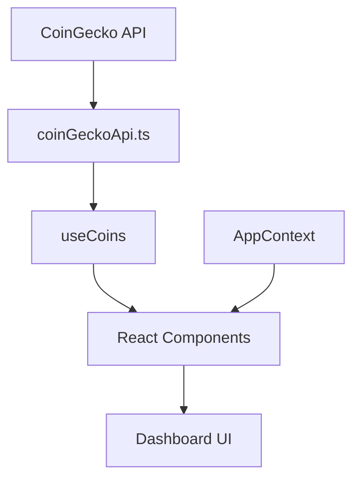
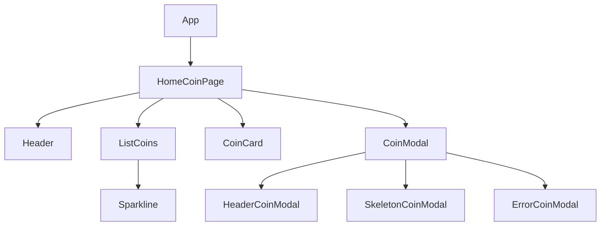
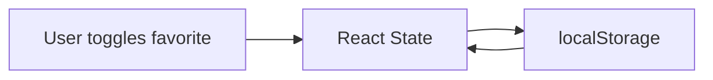
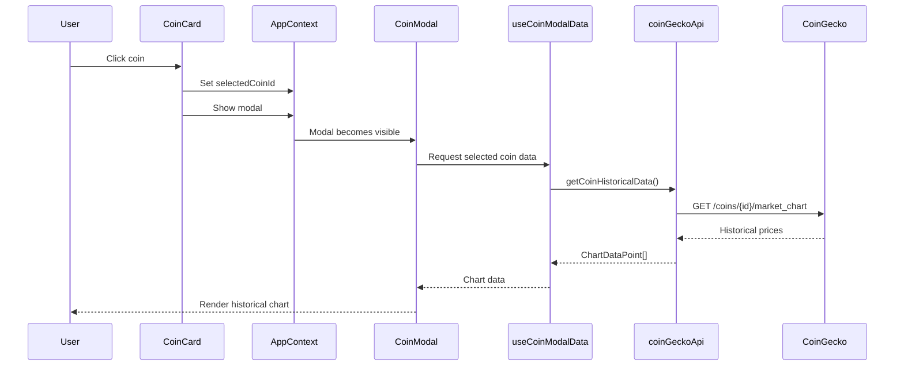
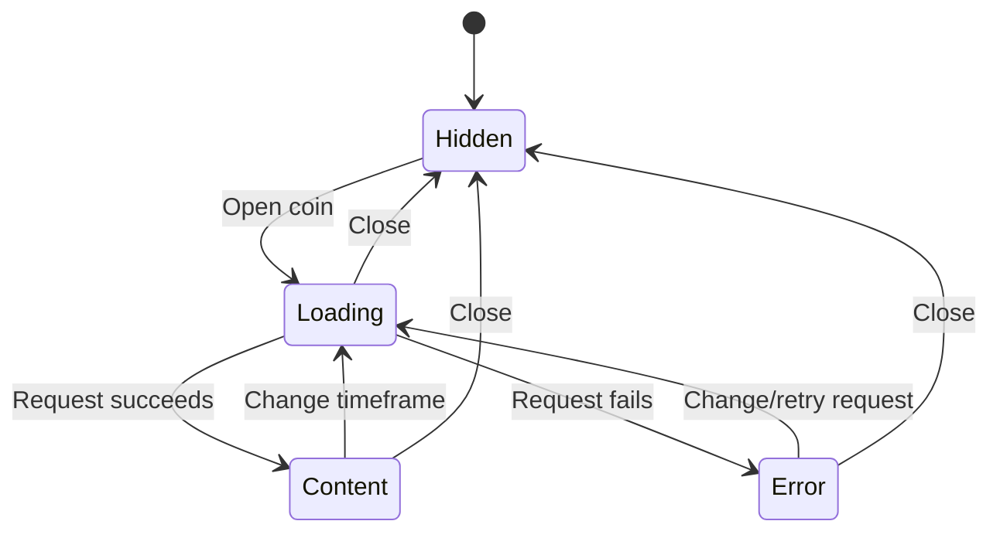
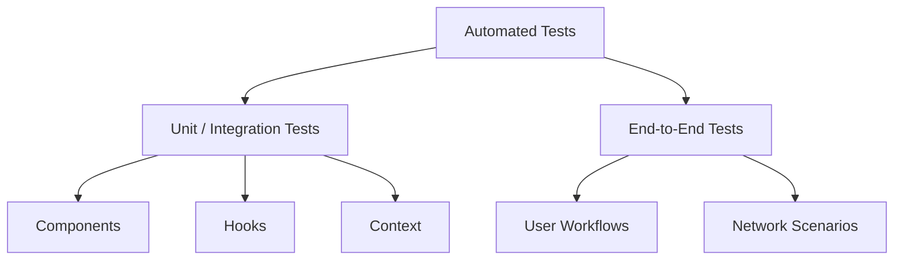

# Krypto — Architecture

## Overview

Krypto is a single-page cryptocurrency analytics dashboard built with React, TypeScript, and Vite.

The application follows a component-based architecture with a clear separation between:

- UI components
- Application state
- Data fetching
- External API communication
- Reusable hooks
- Domain types
- Automated tests

The architecture is intentionally lightweight. Global state is managed through React Context, server state is handled by TanStack Query, and communication with the CoinGecko API is isolated in a dedicated service.

The application currently exposes a single route and focuses on presenting cryptocurrency market data and historical price information through an interactive dashboard.

---

## Application Architecture

At a high level, the application follows this flow:



The application uses two different approaches for managing data:

- **Server state:** TanStack Query handles market data fetched from CoinGecko.
- **Client state:** React Context and local state handle UI state, selected coins, chart timeframes, and favorites.

This separation prevents server data and UI state from being unnecessarily coupled.

---

## Project Structure

The source code is organized by responsibility:

```text
src/
├── assets/
│   └── icon.svg
│
├── components/
│   ├── cards/
│   │   ├── CoinCard.tsx
│   │   └── CoinCard.test.tsx
│   │
│   ├── layout/
│   │   └── Header.tsx
│   │
│   ├── list/
│   │   ├── ListCoins.tsx
│   │   ├── ListCoins.test.tsx
│   │   ├── Sparkline.tsx
│   │   └── Sparkline.test.tsx
│   │
│   ├── modal/
│   │   └── coin modal/
│   │       ├── CoinModal.tsx
│   │       ├── CoinModal.test.tsx
│   │       ├── ErrorCoinModal.tsx
│   │       ├── ErrorCoinModal.test.tsx
│   │       ├── HeaderCoinModal.tsx
│   │       ├── HeaderCoinModal.test.tsx
│   │       ├── SkeletonCoinModal.tsx
│   │       └── hooks/
│   │           ├── useCoinModal.tsx
│   │           └── useCoinModalData.test.tsx
│   │
│   └── ui/
│       └── error/
│           └── ErrorState.tsx
│
├── context/
│   ├── AppContext.ts
│   ├── AppContextProvider.tsx
│   └── hooks/
│       ├── useAppContext.tsx
│       ├── useDataContext.tsx
│       ├── useDataContext.test.tsx
│       └── useUIContext.tsx
│
├── hooks/
│   ├── useCoins.ts
│   └── useCoins.test.ts
│
├── pages/
│   └── HomeCoinPage.tsx
│
├── services/
│   └── coinGeckoApi.ts
│
├── test/
│   ├── setup.ts
│   ├── mocks/
│   │   └── mockCoin.ts
│   └── utils/
│       └── renderWithClient.tsx
│
├── types/
│   └── crypto.ts
│
├── App.tsx
├── App.css
└── main.tsx
```

### Directory Responsibilities

| Directory            | Responsibility                                                       |
| -------------------- | -------------------------------------------------------------------- |
| `components/`        | Reusable UI components organized by feature or visual responsibility |
| `components/cards/`  | Cryptocurrency card components                                       |
| `components/layout/` | Application layout components                                        |
| `components/list/`   | Cryptocurrency list and visualization components                     |
| `components/modal/`  | Coin detail modal and its supporting components                      |
| `context/`           | Application-wide client state                                        |
| `hooks/`             | Reusable application hooks                                           |
| `pages/`             | Page-level components                                                |
| `services/`          | External API communication                                           |
| `test/`              | Shared testing configuration, mocks, and utilities                   |
| `types/`             | Shared TypeScript domain types                                       |
| `assets/`            | Static application assets                                            |

---

## Application Entry Point

The application starts in `main.tsx`.

The entry point is responsible for bootstrapping React and rendering the root application component.

```text
main.tsx
   ↓
App.tsx
   ↓
HomeCoinPage
   ↓
Dashboard Components
```

The application currently uses a **single route**, so a routing library is not required.

---

## Component Architecture

The UI is divided into small components with focused responsibilities.

The main page is composed from reusable pieces rather than containing the entire dashboard implementation in a single component.

A simplified hierarchy is:



### Coin Cards

`CoinCard` is responsible for presenting the main market information for an individual cryptocurrency.

It also provides the interaction point for:

- selecting a coin;
- opening the detail modal;
- toggling favorites.

### Coin List

`ListCoins` is responsible for rendering the collection of market assets and handling the presentation of the filtered results.

### Coin Modal

`CoinModal` provides historical information for the selected cryptocurrency.

The modal is further divided into smaller components:

- `HeaderCoinModal`
- `SkeletonCoinModal`
- `ErrorCoinModal`

This keeps loading, error, and content states separated from the main modal implementation.

---

## State Management

Krypto uses a combination of React local state, React Context, and TanStack Query.

### Local State

`useState` is used for state that belongs to a specific component or hook.

Examples include:

- modal visibility;
- selected coin;
- selected chart timeframe;
- active filter;
- favorites.

### React Context

Application-level client state is exposed through `AppContext`.

The state is conceptually divided into two areas:

#### UI State

Managed through `useUIContext`.

```text
isModalCoinVisible
activeFilter
```

This state controls interface-level behavior.

#### Data State

Managed through `useDataContext`.

```text
selectedCoinId
selectedDays
favorites
```

This state represents user selections and application data that needs to be shared across components.

Components access this state through:

```text
useAppContext()
```

This avoids prop drilling between distant components.

---

## Favorites Persistence

Favorite cryptocurrencies are persisted using the browser's `localStorage`.

The application uses the following storage key:

```text
@krypto:favorites
```

The flow is:



When the application initializes, it attempts to restore the previously saved favorites.

If the stored value cannot be parsed or accessed, the application falls back to an empty favorites list rather than preventing the application from loading.

This provides persistence without requiring a backend or authentication system.

---

## Server State and Data Fetching

Market data is managed with **TanStack Query**.

The `useCoins` hook encapsulates the query:

```ts
useQuery<Coin[]>({
  queryKey: ["top-coins"],
  queryFn: getCoinGeckoMarkets,
  refetchInterval: 60000,
  staleTime: 30000,
});
```

This provides:

- asynchronous request management;
- loading and error states;
- caching;
- automatic refetching;
- stale data management.

Market data is automatically refetched every 60 seconds.

The data is considered fresh for 30 seconds.

The query uses:

```text
["top-coins"]
```

as its cache key.

---

## API Integration

All CoinGecko communication is isolated in:

```text
src/services/coinGeckoApi.ts
```

Axios is used as the HTTP client.

A dedicated Axios instance is configured with the CoinGecko API base URL:

```text
https://api.coingecko.com/api/v3
```

Keeping HTTP communication inside the service layer prevents components from depending directly on Axios or API endpoint details.

### Market Data

The market endpoint retrieves the top 20 cryptocurrencies ordered by market capitalization.

The request uses:

```text
vs_currency = usd
order       = market_cap_desc
per_page    = 20
page        = 1
sparkline   = true
```

The resulting data is consumed by the `useCoins` hook.

---

## Historical Chart Data

Historical market data follows a different flow from the main market query.

Historical data is only requested when the user opens a coin's detail modal.

The flow is:



The historical endpoint is:

```text
GET /coins/{coinId}/market_chart
```

The request uses USD as the reference currency.

The requested period is controlled by the selected timeframe:

```text
1D → 1 day
7D → 7 days
1M → 30 days
```

The service transforms CoinGecko's price tuples into a simpler structure:

```ts
{
  x: timestamp,
  y: price
}
```

This structure is consumed directly by Recharts.

---

## Historical Data State

Historical data is managed independently from the main market query.

The `useCoinModalData` hook uses React's `useActionState` and `useTransition` to handle the asynchronous historical-data request.

The hook is responsible for:

- fetching historical data;
- exposing loading state;
- exposing errors;
- reacting to changes in the selected coin;
- reacting to changes in the selected timeframe;
- closing the modal;
- handling the `Escape` key.

This keeps the asynchronous modal behavior outside the visual component.

---

## Chart Architecture

Historical prices are visualized using Recharts.

The main chart uses:

```text
ResponsiveContainer
└── AreaChart
    ├── XAxis
    ├── YAxis
    ├── Tooltip
    └── Area
```

The chart automatically adapts to its container width.

The X-axis formatting changes according to the selected timeframe:

- `1D` displays time;
- `7D` and `1M` display calendar dates.

Currency values are formatted using the browser's `Intl.NumberFormat` API.

---

## Modal Behavior

The coin detail modal has three main UI states:



The modal can be closed through:

- the close button;
- clicking the backdrop;
- pressing `Escape`.

Clicking inside the modal content does not close the modal because event propagation is stopped.

---

## Loading and Error Handling

The application explicitly handles asynchronous states instead of rendering incomplete data.

### Market Data

When the main market request fails, the application displays the reusable `ErrorState` component.

The UI provides a recovery action that allows the user to retry the request.

### Historical Data

The coin modal has dedicated states for:

```text
Loading → SkeletonCoinModal
Error   → ErrorCoinModal
Success → Historical Chart
```

This keeps the user interface predictable during network delays and failures.

---

## Styling

The application uses **Tailwind CSS**.

Styling is applied directly through utility classes in the React components.

No separate component-level styling abstraction is used.

This approach keeps the styling close to the markup and allows responsive behavior and visual states to be expressed directly alongside the component structure.

Lucide React is used for interface icons.

---

## Type Safety

TypeScript is used throughout the application.

Domain-specific types are centralized in:

```text
src/types/
```

The cryptocurrency domain model is defined in:

```text
src/types/crypto.ts
```

API-specific structures that are only relevant to the service layer remain close to the corresponding API implementation.

This keeps shared application types separate from implementation-specific API response structures.

---

## Testing Architecture

Testing is divided into two main layers:



### Unit and Integration Tests

Vitest and React Testing Library are used to test application behavior at the component and hook level.

The test suite covers areas such as:

- cryptocurrency cards;
- coin lists;
- sparklines;
- modal components;
- modal hooks;
- application context;
- data fetching hooks.

Shared test configuration is located under:

```text
src/test/
```

Reusable mocks and rendering utilities are kept separate from production code.

---

## End-to-End Testing

Playwright is used to validate complete user workflows in a browser environment.

The E2E suite verifies scenarios such as:

### Dashboard

- header rendering;
- search functionality;
- coin list rendering;
- empty search results;
- clearing the search;
- market refresh;
- market API failures.

### Coin Modal

- opening a coin's details;
- displaying the selected coin;
- switching between historical timeframes;
- triggering historical API requests;
- closing the modal;
- closing through the `Escape` key;
- handling historical API failures.

External API calls are intercepted during E2E tests.

This makes the tests deterministic and avoids depending on the availability or current response of the CoinGecko service.

---

## Test Data and Mocking

The E2E suite uses mocked CoinGecko responses through Playwright's request interception.

For example:

```text
/api/v3/coins/markets
/api/v3/coins/{id}/market_chart
```

are intercepted and replaced with controlled responses.

This allows the test suite to explicitly simulate:

- successful requests;
- specific cryptocurrency datasets;
- HTTP 500 failures;
- historical chart responses.

Unit and integration tests also use shared mocks located under:

```text
src/test/mocks/
```

---

## Design Decisions

### TanStack Query for Server State

TanStack Query was chosen to manage server state because market data is asynchronous, cached, periodically refreshed, and subject to loading and error states.

This keeps request lifecycle management out of the UI components.

### React Context for Shared Client State

React Context was used for application-wide client state because the project has a relatively small state surface.

Using Context avoids prop drilling without introducing the complexity of a larger state-management library.

### Axios for API Communication

Axios provides a dedicated HTTP client abstraction and allows the application to centralize communication with CoinGecko through a configured instance.

### Dedicated API Service

API calls are isolated from UI components in `coinGeckoApi.ts`.

This reduces coupling between the presentation layer and external API implementation details and makes the data layer easier to test and maintain.

### Component Composition

The UI is split into focused components instead of implementing the dashboard as a single large component.

The coin modal is a good example: loading, error, header, and data-fetching behavior are separated into dedicated components and hooks.

### Local Storage for Favorites

Favorites are persisted locally because they represent a user preference that does not require server synchronization.

This provides persistence across browser sessions without introducing backend infrastructure.

### Playwright API Interception

E2E tests intercept external API requests rather than relying on live CoinGecko responses.

This makes tests:

- deterministic;
- faster;
- independent of external API availability;
- able to reproduce failure scenarios reliably.

---

## Architectural Principles

The current architecture follows a few core principles:

1. **Keep API communication outside UI components.**
2. **Separate server state from client/UI state.**
3. **Keep components focused on presentation and interaction.**
4. **Extract asynchronous behavior into reusable hooks.**
5. **Prefer simple state-management solutions when application complexity does not justify heavier alternatives.**
6. **Keep external API dependencies isolated.**
7. **Test both isolated behavior and complete user workflows.**
8. **Make network failure states explicit and testable.**

The architecture is intentionally pragmatic: it provides clear separation of responsibilities while avoiding unnecessary abstractions for a single-page application of this size.
